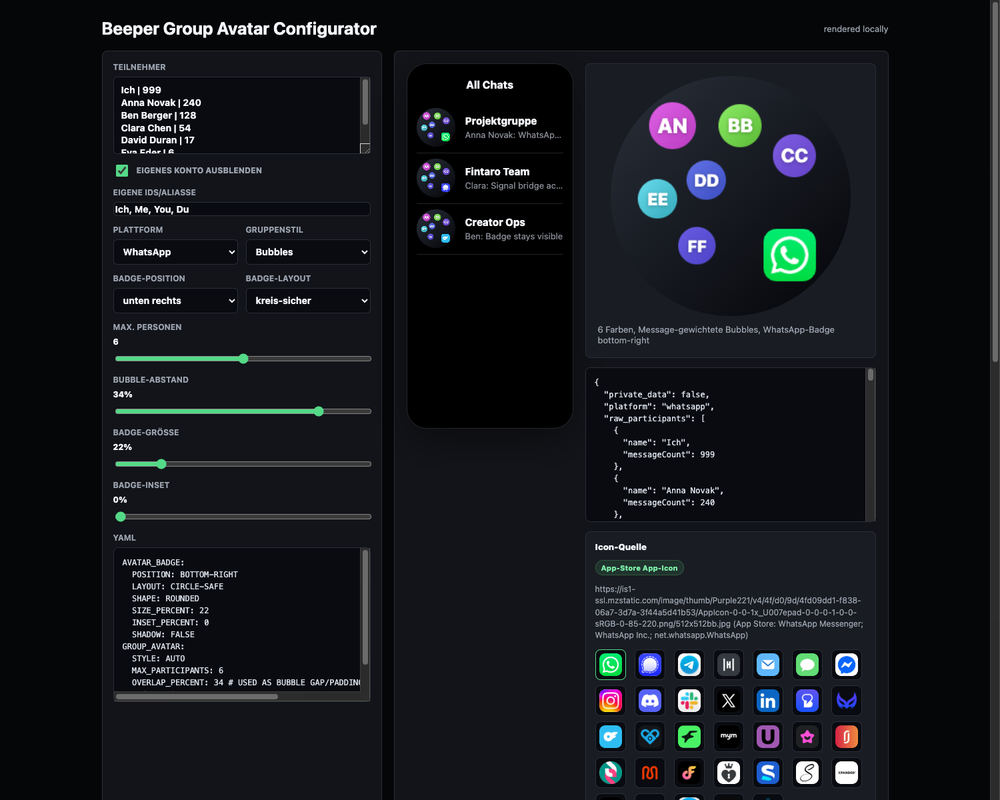
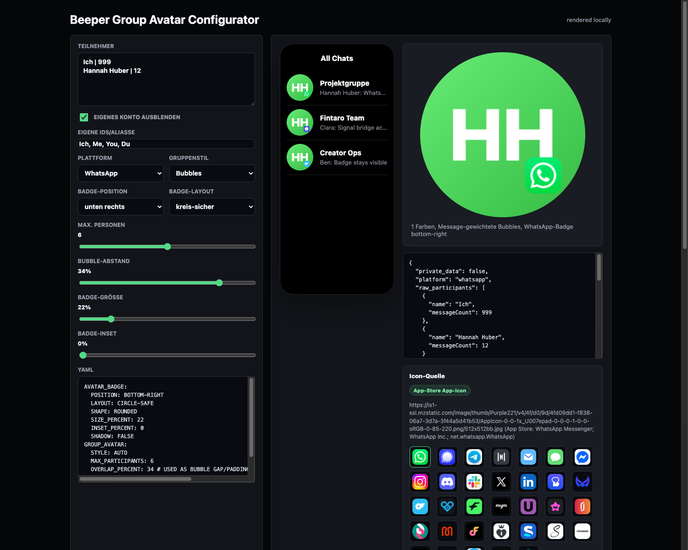
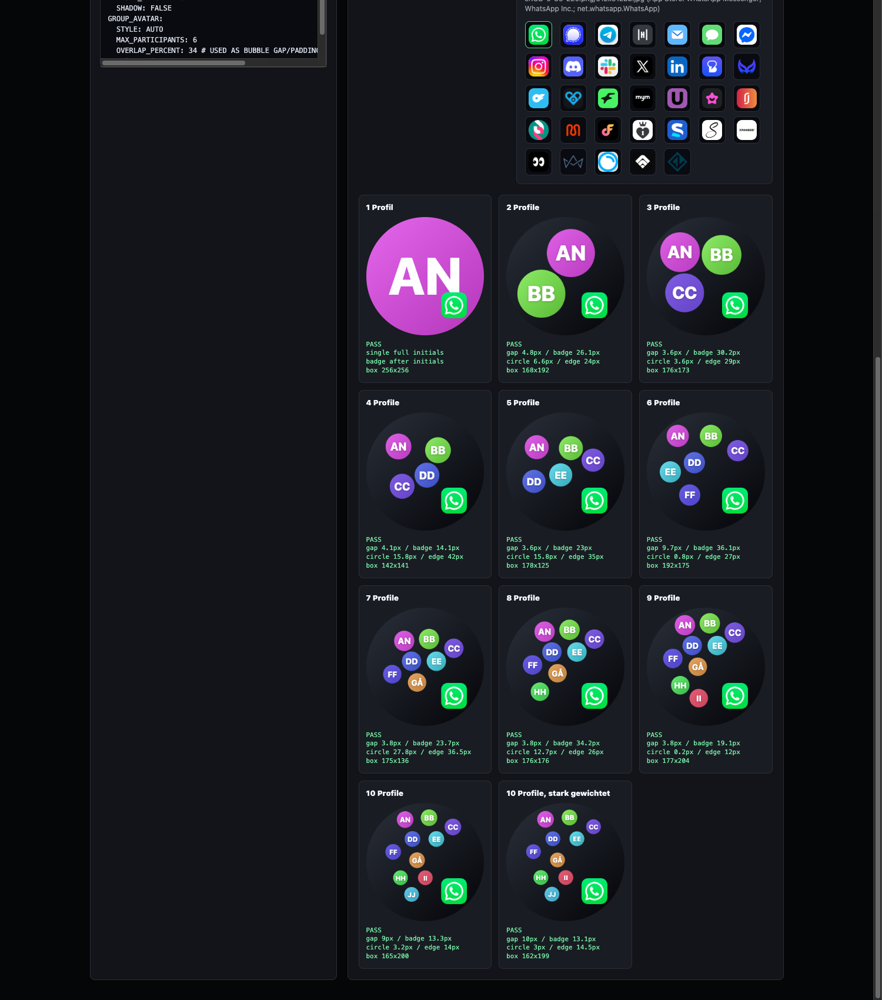
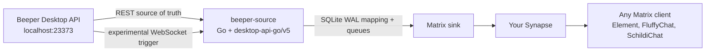
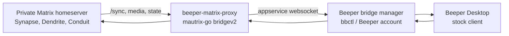

# beeper-matrix-proxy

**Expose rooms from a private Matrix homeserver inside Beeper Desktop, using a
stock Beeper client and a bridgev2 custom bridge.**

[](https://go.dev/)
[](https://matrix.org/)
[](https://developers.beeper.com/bridges/self-hosting)
[](#current-status)

`beeper-matrix-proxy` is an experimental Matrix/Beeper proxy built on
[`mautrix-go` bridgev2](https://pkg.go.dev/maunium.net/go/mautrix/bridgev2).
Its original mode treats a normal Matrix homeserver as the remote network and
exposes joined rooms inside Beeper through Beeper's self-hosted bridge flow
(`bbctl`). A new `beeper-source` subsystem starts the reverse direction:
Beeper Desktop API as the source network, with your own Synapse/Matrix server as
the destination appservice side.

It does **not** patch Beeper Desktop. The bridge tries to speak the data contract
that Beeper already understands: room features, Matrix events, media metadata,
portal rooms, and appservice websocket traffic.

## Portable Matrix Avatar Sync

The Beeper-source avatar path is now documented as a portable Matrix-native
sync that can be installed against any homeserver with normal media upload and
room-state APIs. The reusable part is public-safe: static brand icons, generated
fallback avatars, group-avatar bubble layout, Matrix room avatar writes, and a
local configurator for visual checks. Private tokens, room IDs, screenshots,
SQLite databases, and contact-photo override files stay outside the repository.

Start here when installing the avatar/room sync on another Synapse, Etke, or
compatible Matrix server:

- [docs/matrix-avatar-sync-portable.md](docs/matrix-avatar-sync-portable.md)
- [docs/examples/avatar-badge.yaml](docs/examples/avatar-badge.yaml)
- [infra/avatar-configurator/index.html](infra/avatar-configurator/index.html)

### Avatar Sync Screenshots

The screenshots below are generated from public-safe demo data in the local
configurator. They show the same native Matrix `m.room.avatar` output that
Cinny and Element receive from the sync.

| Configurator | Single visible member | 1-10 group layouts |
|---|---|---|
|  |  |  |

## Matrix Archive Backup Sync

`matrix-archive-sync` is a standalone Rust CLI for creating a readable,
standard-Matrix-only chat archive. It treats Beeper/BIPA/PIPA chats only as
normal Matrix rooms after they have already been mirrored into Synapse; it does
not call Beeper or PIPA APIs and it does not send messages.

The archive format is local-first and restic-friendly:

```text
matrix-archive/
  archive.sqlite
  objects/sha256/ab/cd/<content-hash>
  html/
  events.jsonl
  snapshot/
```

The SQLite database stores zstd-compressed raw Matrix events plus extracted
readable fields for search and export. Media is downloaded from `mxc://` URLs
through the standard authenticated Matrix media endpoint and stored once in a
SHA-256 content-addressed object store. Missing media, limited timelines, and
undecrypted E2EE events are recorded as explicit archive gaps.

Typical local usage:

```bash
cd matrix-archive-sync
export MATRIX_HOMESERVER_URL="https://matrix.example.local"
export MATRIX_ACCESS_TOKEN="..."

cargo run -- --archive-dir ../matrix-archive sync --download-media --refresh-room-state --passes 1
cargo run -- --archive-dir ../matrix-archive backfill --download-media --room-limit 4
cargo run -- --archive-dir ../matrix-archive export-html --output-dir ../matrix-archive/html
cargo run -- --archive-dir ../matrix-archive export-jsonl --output ../matrix-archive/events.jsonl
cargo run -- --archive-dir ../matrix-archive snapshot --output-dir ../matrix-archive/snapshot
restic backup ../matrix-archive/snapshot ../matrix-archive/objects
```

The v1 restore target is a readable/searchable offline archive, not replaying
original Matrix event IDs or historical signatures into old rooms.

## Production Winner Stack Blueprint

The recommended small-host deployment blueprint lives in
[infra/winner-stack](infra/winner-stack/README.md).
It captures the production combination for an 8 GB RAM / 256 GB local host:

```text
Synapse + matrix-docker-ansible-deploy/Etke-compatible Ansible
+ Element Web + Cinny
+ minimal separate Nextcloud Docker Compose
+ shared PostgreSQL with separate DBs/users
+ Redis only for Nextcloud
+ S3 primary media storage for Synapse
+ S3 primary object storage for Nextcloud
+ restic backups to a separate bucket/account
```

The blueprint intentionally does not use Nextcloud as a Matrix media backend,
does not use WebDAV/FUSE as primary storage, does not start Nextcloud AIO, does
not run local Whisper permanently, and does not include Matrix Media Repo as a
default 8 GB-host component.

Included files:

| Path | Purpose |
|---|---|
| [infra/winner-stack/matrix-docker-ansible-deploy/vars.example.yml](infra/winner-stack/matrix-docker-ansible-deploy/vars.example.yml) | Synapse/MDAD vars for S3 media, Element, Cinny, Traefik, and conservative resource settings. |
| [infra/winner-stack/nextcloud/docker-compose.yml](infra/winner-stack/nextcloud/docker-compose.yml) | Minimal Nextcloud + Redis Compose attached to the Matrix Traefik network. |
| [infra/winner-stack/nextcloud/objectstore.config.php.example](infra/winner-stack/nextcloud/objectstore.config.php.example) | Nextcloud primary S3 object storage config. |
| [infra/winner-stack/backup/run-backup.sh](infra/winner-stack/backup/run-backup.sh) | PostgreSQL/config/archive backup into encrypted restic snapshots. |
| [infra/winner-stack/backup/restore-check.sh](infra/winner-stack/backup/restore-check.sh) | Non-destructive restic restore and checksum validation. |
| [infra/winner-stack/backup/backup-policy.md](infra/winner-stack/backup/backup-policy.md) | Backup boundaries, restore order, and operating rules. |

Local archive evidence is generated and checked outside the public repository.
Keep room counts, event counts, backup sizes, screenshots, and restic output in
private evidence folders rather than committing them here.

`sync --refresh-room-state` fetches `/joined_rooms` and each room's current
`/state`, so room names, service spaces, and `m.room.avatar` state are backed up
even when an incremental `/sync` response omits old state events. The snapshot
command writes a restic-ready `snapshot/archive.sqlite` plus `manifest.json`
that points at the content-addressed media objects included in the backup.
`repair-media --download-media` can re-scan already stored raw events when a new
media extractor is added; it is used for Beeper per-message profile avatars so
the static HTML archive shows sender photos offline.
Rooms-only avatar refreshes compute content hashes for downloaded Beeper/BIPA
avatars and only reuse cached Matrix MXC URLs when the hash still matches, so a
changed profile picture behind the same Beeper asset URL is uploaded as a fresh
Matrix room avatar.

## Beeper Source Mode

`beeper-source` is the foundation for exposing Beeper's existing cloud/local
accounts as standard Matrix rooms:



The first implemented slice is intentionally infrastructure-heavy: SDK pinning,
local-only config, deterministic Matrix transaction IDs, SQLite WAL schema,
message/portal/puppet mapping, pending mutation storage, all-chat WebSocket
subscription payloads, echo suppression, media size fallback policy, and
Deeper-style platform detection. This gives the eventual Matrix appservice
adapter a stable low-latency core without coupling it to Beeper Desktop UI
patches.

Current `beeper-source` implementation status:

| Area | Status | Notes |
|---|---:|---|
| Beeper Desktop Go SDK | Supported | Pinned to `github.com/beeper/desktop-api-go/v5@v5.0.1`. |
| `/v1/info` healthcheck | Supported | Uses the official SDK and keeps Beeper local-only by default. |
| Chat/message REST abstraction | Partial | Adapter maps SDK chats/messages into bridge-neutral structs. |
| WebSocket subscription | Supported | Generates Beeper's `subscriptions.set` all-chat command; reconnect loop is still next work. |
| SQLite WAL state | Supported | Creates `portal`, `puppet`, `message_mapping`, `reaction_mapping`, `pending_mutation`, `media_cache`, and `queue`. |
| Deterministic txn IDs | Supported | Stable hash from chat/message/mutation/version. |
| Beeper -> Matrix text mirror core | Supported | `cmd/beeper-source` can create Matrix rooms and mirror Beeper text messages into them. |
| Matrix -> Beeper text/media core | Supported | Matrix `/sync` reader forwards user text and Matrix media from portal rooms to Beeper with stored sync tokens. |
| Matrix -> Beeper edits/deletes/reactions | Supported | Live-tested in the Signal test group through Beeper Desktop API update/delete/reaction endpoints. |
| Cinny visibility | Supported | Verified in Cinny v4.11.1: WhatsApp, Signal, and Matrix test rooms appear as Matrix rooms. |
| Beeper chat avatars -> Matrix room icons | Supported | Beeper `imgURL`/asset avatars are uploaded to Matrix and refreshed on existing portal rooms; by default room avatars keep the real chat/person picture and add a larger app-like messenger badge for Cinny/Element. Rooms without a real photo get a neutral person/default avatar plus the badge. |
| All active Beeper chats in Matrix/Cinny | Supported | `cmd/beeper-source -rooms-only` creates/updates portal rooms for every non-archived Beeper chat without importing history or sending to contacts. Archived chats can be opted in. |
| Platform names/icons | Supported | Rooms-only mode groups rooms into Matrix Spaces per Beeper `network` (`WhatsApp`, `Signal`, `Telegram`, etc.); embedded local brand-icon PNGs are cached once per service for service spaces and used as the badge source for room avatars. |
| Matrix Spaces by messenger | Supported | Rooms-only import creates a Beeper root space and top-level service spaces for WhatsApp, Signal, Telegram, bridgev2, and Beeper(Matrix), then links portal rooms under the matching service. |
| Echo suppression | Supported | Persistent SQLite echo table maps Beeper echoes back to the original Matrix event, including changed echo versions after edits. |
| Media policy | Partial | Matrix -> Beeper multipart upload works; Beeper -> Matrix oversized media and media-edit upload failures fall back to readable Matrix notices. Full streaming for very large files is still future work. |
| Deeper enrichment | Partial | Platform detection implemented; contact merging and analytics reports are later. |

Local E2E evidence policy:

| Path | Test group | Result |
|---|---|---|
| All-chat rooms-only import | Local Synapse + Cinny | Beeper discovery/import is paginated, resumable, and idempotent. Local evidence should be kept outside the public repo because it can contain room names, user IDs, and screenshots. |
| Rooms-only backpressure/retry | Local Synapse | Verified locally with resumable room creation, adaptive retry/backpressure, and an idempotency pass. Keep exact room counts and timings in private run logs. |
| Matrix Spaces by service | Local Synapse + Cinny | Rooms are linked under messenger-service spaces when spaces are enabled. Verify locally with `/state/m.space.child` and Cinny screenshots kept outside the public repo. |
| Native avatar badges | Local Synapse + Cinny/Element | Platform avatar cache uses embedded local brand-icon PNG media for service spaces. Portal room fallbacks use a generated person/default avatar plus a service badge, not a pure logo-only room avatar. Verify exact MXC URIs and screenshots in private run logs. |
| Matrix/Cinny -> Beeper text, edit, reaction, delete | Dedicated test groups only | Verified with non-contact test rooms. Exact Beeper message IDs and Matrix event IDs must stay out of public docs. |
| Matrix/Cinny -> Beeper image/file/GIF/audio | Dedicated test groups only | Verified with local test payloads in WhatsApp/Signal-style test rooms. Exact remote identifiers must stay out of public docs. |
| Beeper -> Matrix reply/media/audio/GIF | Dedicated test groups only | Verified as Matrix events with relation metadata and media msgtypes. Exact event IDs and room names must stay out of public docs. |
| Cinny room list and avatars | Local Synapse + Cinny | Verify structurally in Cinny; keep screenshots and room names in private evidence folders. |
| One-run echo mapping | Dedicated test groups only | Matrix-originated messages are mapped to returned Beeper IDs immediately so edit/delete/reaction mutations can target the same message in one proxy run. |

### Show Beeper Bridges In Cinny

Goal: use Cinny as a normal Matrix client and see chats from Beeper's connected
accounts (WhatsApp, Telegram, Signal, X, and other Beeper-backed networks) as
Matrix rooms on your own Synapse.

For a safe first import that only creates/updates rooms and does not send
anything back to real Beeper contacts:

```bash
export BEEPER_MATRIX_PROXY_SYNC_MODE=read_only
export BEEPER_MATRIX_PROXY_DISABLE_MATRIX_TO_BEEPER=true
# rooms-only enables Matrix Spaces automatically, omits duplicate Beeper/service prefixes,
# and keeps Beeper chat/person avatars preferred
export BEEPER_MATRIX_PROXY_PORTAL_WORKERS=8
export BEEPER_MATRIX_PROXY_PORTAL_TIMEOUT_SECONDS=180
# Optional: explicitly restore a custom room-name prefix
# export BEEPER_MATRIX_PROXY_MATRIX_ROOM_PREFIX="Beeper: "
# Optional: export BEEPER_MATRIX_PROXY_INCLUDE_ARCHIVED=true
unset BEEPER_MATRIX_PROXY_BEEPER_CHAT_IDS

go run ./cmd/beeper-source -db beeper-source-all-chats.db -once -rooms-only
```

This uses Beeper's paginated `/v1/chats` API, so it is not limited to the first
page. Rooms-only mode also forces `sync.mode=read_only` and
`safety.disable_matrix_to_beeper=true`, even if the environment was configured
for bidirectional sync. By default, archived chats are skipped so Cinny mirrors
the normal active Beeper chat list.

Bulk room creation is resumable. Existing accessible portal rows are skipped,
stale rows whose Matrix rooms are no longer accessible are recreated, platform
avatars use the `media_cache` key family `platform-logo-v5:*`, and Matrix `429
M_LIMIT_EXCEEDED` responses honor `retry_after_ms`/`Retry-After` with adaptive
worker backpressure instead of aborting the whole import. The import also
creates Matrix Spaces: an All Chats root space links service spaces, and each
service space links its portal rooms so Cinny can navigate by messenger instead
of one long flat room list.

Matrix Space grouping is configurable. The default `platform` mode creates
`All Chats -> WhatsApp/Signal/Telegram/... -> rooms`. For a team/login style
hierarchy, set `BEEPER_MATRIX_PROXY_MATRIX_SPACE_GROUPING=platform-account`;
that creates `All Chats -> platform -> login/channel -> rooms`. The platform
spaces use the native app icon as their avatar, while login/channel spaces use
an initials avatar with the platform badge in the lower-right corner.

```bash
export BEEPER_MATRIX_PROXY_MATRIX_SPACES=true
export BEEPER_MATRIX_PROXY_MATRIX_SPACE_GROUPING=platform-account # platform, platform-account, account, none
```

Room names omit the bracketed platform by default because the Matrix
Spaces already provide the service grouping. Set
`BEEPER_MATRIX_PROXY_MATRIX_ROOM_INCLUDE_PLATFORM=true` to restore names like
`[Telegram] Chat Name`; set `BEEPER_MATRIX_PROXY_MATRIX_ROOM_PREFIX="Beeper: "`
too if you explicitly want the old prefixed form. Set
`BEEPER_MATRIX_PROXY_MATRIX_PLATFORM_AVATARS=true` only when you explicitly want
every portal room to use a generated person/default avatar with the messenger
badge instead of the Beeper/BIPA chat profile picture. With the default setting, Beeper `imgURL` avatars are fully
downloaded through the Desktop API, including relative BIPA asset URLs resolved
against `BEEPER_MATRIX_PROXY_BEEPER_BASE_URL`; generated person/default avatars
are used only as a fallback when no chat/person image exists. For direct chats
where Beeper exposes no chat-level `imgURL`,
`BEEPER_MATRIX_PROXY_MATRIX_DM_PARTICIPANT_AVATARS=true` uses an available
participant Beeper avatar as the Matrix room avatar; set it to `false` to keep
the generated fallback for those rooms.
`BEEPER_MATRIX_PROXY_MATRIX_AVATAR_BADGES=true` is enabled by default and
composes a larger app-like messenger badge into real chat/person room avatars.
Because the badge is written into the normal Matrix `m.room.avatar` media, Cinny
and Element show the service marker without any client patch. Set it to `false`
if you want unmodified Beeper/BIPA avatar images only.

Avatar badge layout is configurable for two public-safe avatar types:
real contact/photo avatars plus a messenger badge, and generated initials
avatars plus a messenger badge when no source photo exists. The default
`circle-safe` layout keeps the whole badge inside a hard circular client crop.
Use `edge` if your client does not clip avatars to a circle and you want the
service icon visually tighter in the lower-right corner.

```bash
export BEEPER_MATRIX_PROXY_MATRIX_AVATAR_BADGE_POSITION=bottom-right # bottom-right, bottom-left, top-right, top-left
export BEEPER_MATRIX_PROXY_MATRIX_AVATAR_BADGE_LAYOUT=circle-safe    # circle-safe or edge
export BEEPER_MATRIX_PROXY_MATRIX_AVATAR_BADGE_SHAPE=rounded        # rounded or circle
export BEEPER_MATRIX_PROXY_MATRIX_AVATAR_BADGE_SIZE_PERCENT=34
export BEEPER_MATRIX_PROXY_MATRIX_AVATAR_BADGE_INSET_PERCENT=0
export BEEPER_MATRIX_PROXY_MATRIX_AVATAR_BADGE_SHADOW=true
```

The same values can live in a private or deployment-local YAML file without any
contact data:

```bash
export BEEPER_MATRIX_PROXY_AVATAR_BADGE_CONFIG="$HOME/Library/Application Support/matrix-archive-sync/avatar-badge.yaml"
```

```yaml
avatar_badge:
  position: bottom-right
  layout: circle-safe
  shape: rounded
  size_percent: 34
  inset_percent: 0
  shadow: true

group_avatar:
  style: auto
  max_participants: 10
  overlap_percent: 34
  exclude_self: true
  self_ids: []
```

For manually approved contact-photo merging, keep a private override file
outside the repo and point the sync at it:

```bash
export BEEPER_MATRIX_PROXY_CONTACT_AVATAR_OVERRIDES="$HOME/Library/Application Support/matrix-archive-sync/contact-avatar-overrides.yaml"
```

The override file wins before Beeper/BIPA participant or chat avatars:

```yaml
contacts:
  - display_name: "Example Person"
    aliases:
      - "Example WhatsApp Name"
    beeper_chat_ids:
      - "!example:beeper.local"
    sender_ids:
      - "@example:whatsapp"
    avatar_file: "~/Pictures/Contact Avatars/example-person.jpg"
    confidence: "manual"
```

To import reachable Beeper message history into those Matrix portal rooms
without sending anything back to real contacts, run the read-only history
backfill:

```bash
export BEEPER_MATRIX_PROXY_SYNC_MODE=read_only
export BEEPER_MATRIX_PROXY_DISABLE_MATRIX_TO_BEEPER=true
export BEEPER_MATRIX_PROXY_EXCLUDE_ACCOUNT_IDS=sh-vcvm-matrix,matrix,beeper-matrix-proxy

go run ./cmd/beeper-source -db beeper-source-all-chats.db -once -backfill-history -history-chat-limit 20
```

The backfill is resumable. It stores a per-chat `oldestCursor`, skips already
mapped Beeper message IDs, and excludes Matrix bridge/source accounts by default
in rooms-only and `-backfill-history` modes to avoid feeding newly-created
portal or backup rooms back into the Beeper source list.

For durability beyond native Matrix `/sync`, the backfill also stores raw Beeper
Desktop API message JSON in SQLite and mirrors every Beeper attachment as Matrix
media. Multi-image albums or messages with multiple files become multiple
Matrix media events linked by deterministic mappings, so later archive runs can
download the resulting `mxc://` media and render it offline.

For a fast refresh of already-created rooms, for example after changing room
name/avatar settings, you can set `BEEPER_MATRIX_PROXY_PORTAL_CHECK_ACCESS=false`
and `BEEPER_MATRIX_PROXY_MATRIX_SPACES=false`. That skips stale-room probing and
space relinking while still running in `read_only` mode and refreshing existing
portal room names, topics, and avatars.
Set `BEEPER_MATRIX_PROXY_MATRIX_FORCE_AVATAR_SYNC=true` for a one-shot repair
run that rewrites avatar state even when the local sync value already matches.

```bash
export BEEPER_ACCESS_TOKEN="..."
export MATRIX_ACCESS_TOKEN="..."
export BEEPER_MATRIX_PROXY_MATRIX_HOMESERVER_URL="https://matrix.example.local"
export BEEPER_MATRIX_PROXY_MATRIX_USER_ID="@beeper_source:example.local"
export BEEPER_MATRIX_PROXY_MATRIX_INVITE_USER_ID="@cinny_test:example.local"
export BEEPER_MATRIX_PROXY_MATRIX_INSECURE_TLS=true # only for a local self-signed cert

go run ./cmd/beeper-source -db beeper-source.db -once
```

After the first reconcile pass, open Cinny at:

```text
https://cinny.example.local/login/matrix.example.local
```

The current implementation is a pragmatic v1 mirror: messages are sent by the
configured Matrix account with a Beeper per-message profile and sender prefix so
Cinny can show who wrote them. For bidirectional testing, run the proxy with a
dedicated Matrix bridge account and set `BEEPER_MATRIX_PROXY_MATRIX_INVITE_USER_ID`
to the Matrix user that will use Cinny. The Matrix `/sync` reader ignores events
from the bridge account, forwards user-authored portal-room messages to Beeper,
and suppresses the Beeper echo on the next reconcile pass. The next production
step is a true Synapse appservice registration for one Matrix ghost user per
Beeper sender.

## Performance Snapshot

Latest local run on Apple M4 Pro, using `./scripts/perf.sh` plus disposable
Docker Synapse E2E:

| Area | Before | Now | Improvement |
|---|---:|---:|---:|
| Message content clone latency | ~2408 ns/op | ~120 ns/op | ~20x faster |
| Message content clone allocations | 20 allocs/op | 5 allocs/op | 75% fewer |
| Message content clone bytes | 1425 B/op | 576 B/op | ~60% fewer |
| Repeated fallback avatar path | 38 allocs/run | 0 allocs/op | allocation-free cache hit |
| Poll/raw event clone allocations | ~60 allocs/run | 12 allocs/op | ~80% fewer |
| Default remote `/sync` burst window | 50 timeline events | 100 timeline events | 2x larger |
| Local Synapse burst E2E | 40/40 messages | 100/100 messages | larger verified burst |
| `beeper-source` 500-text-message reconcile benchmark | ~25.0 ms/op, 1.44 MB/op | ~31.2 ms/op, 2.83 MB/op | steady with raw sidecar storage, reply/avatar additions, and media fallback checks |
| Matrix -> Beeper echo mapping | required a second manual run | one proxy run when Matrix events were handled | faster stable mappings with no extra idle reconcile |

The current 100-message Synapse burst test delivered all events with roughly
`1.88s` send time and `15ms` sync pickup time in the local harness. A mixed
modality E2E run also verifies text, image, file, audio, video, location, emote,
notice, edit, sticker, reaction, redaction, poll start, room state, and call
invite events against the same disposable Synapse.
These
numbers are not a production SLA, but they make the hot paths reproducible and
guard against regressions.

## The Short Version

| Question | Answer |
|---|---|
| Can I sign into an arbitrary Matrix homeserver directly from Beeper Desktop? | Not generally. Beeper Desktop is designed around Beeper accounts and Beeper-managed bridge accounts. |
| Can this project show rooms from my private Matrix server in Beeper? | Yes, that is the goal: private Matrix homeserver -> this bridge -> Beeper. |
| Can this reuse Beeper Cloud's existing WhatsApp/Telegram/Signal bridges on my own Synapse? | Experimentally, yes through `beeper-source`: Beeper Desktop API is treated as the source and your Synapse receives portal rooms. |
| Can I run official/community bridges for my own Synapse instead? | Yes. Run the upstream Matrix bridge against your Synapse as its own appservice. |
| Can one bridge feed both Beeper and my Synapse? | Usually not safely from the same database. Run separate bridge instances or build a dedicated fanout layer. |

## Architecture



Beeper's official self-hosting docs describe `bbctl` as a tool for running
self-hosted bridges with a Beeper account. Beeper's bridge metadata also
distinguishes cloud, self-hosted, local, and platform-sdk providers. This matters
because a Beeper Cloud bridge is not a portable appservice registration that can
simply be pointed at your own Synapse.

## Current Status

This is a working research/prototype bridge, not a polished product. It already
contains the core compatibility fixes that made private Matrix rooms usable in
Beeper during testing:

- burst-safe Matrix `/sync`
- room discovery and portal creation
- message, edit, reply, and relation ID rewriting
- Beeper-compatible poll fallback normalization
- media reupload between homeservers
- opt-in bridgev2 direct media support with signed, expiring media IDs
- live typing notifications and read receipts
- Matrix call invites bridged as safe notices
- conservative media size capabilities to avoid proxy-side HTTP 413 failures
- restart-safe remote reaction redactions
- lean Matrix sync filter with lazy-loaded members
- bounded echo-suppression cache for Beeper -> Matrix sent events
- cached generated fallback avatars for stale or unavailable remote media
- reproducible benchmarks and local Synapse burst E2E artifacts
- multi-Synapse E2E runs, including optional parallel execution across
  disposable homeservers
- mixed-modality local Synapse E2E coverage for text, image, file, audio, video,
  location, emote, notice, edits, stickers, reactions, redactions, polls, room
  state, and call notices
- real Synapse checks for upload-limit enforcement, room profile state
  (`m.room.name`, `m.room.topic`, `m.room.avatar`), and reply/thread relations
- real Synapse edge probes for media config, history pagination, and
  restart/reconnect continuity with the previous sync token
- one explicit 30-point Synapse E2E matrix that exercises the full dev checklist
  on every disposable homeserver

The remaining work is mostly around completeness: richer voice/GIF behavior,
two-phase sync checkpointing, Beeper UI poll round-trip testing, sync-gap
backfill, and safe cleanup tooling for old broken backfill events.

## Feature Matrix

Legend:

- **Supported**: implemented and covered by tests or live smoke testing
- **Partial**: implemented enough to be useful, but still missing edge cases or full E2E coverage
- **Planned**: intentionally not wired yet
- **Not supported**: not safe to expose as a native Beeper feature

| Feature | Status | Direction | Verification | Notes |
|---|---:|---|---|---|
| Text messages | Supported | Matrix -> Beeper, Beeper -> Matrix | Live smoke test | Plain `m.room.message` events round-trip. |
| Burst delivery | Supported | Matrix -> Beeper | Real Synapse E2E | Remote sync timeline limit is raised to avoid losing fast messages. |
| Room discovery | Supported | Matrix -> Beeper | Live smoke test | Joined remote Matrix rooms are synced as Beeper portal rooms. |
| All active Beeper chat discovery | Supported | Beeper -> Matrix | Local rooms-only import | The Beeper source mode auto-pages `/v1/chats` and can create Cinny-visible rooms for all non-archived Beeper chats. |
| Room name/topic/avatar | Supported | Matrix -> Beeper | Real Synapse E2E | Uses Matrix room state during chat sync. |
| Platform labels/icons | Supported | Beeper -> Matrix | Unit tests + local rooms-only import | Uses Beeper `network` names for Matrix Spaces and embedded brand-icon PNG avatars for WhatsApp/Signal/Telegram/etc.; local import caches `platform-logo-v5:*` icons. Portal rooms prefer manual overrides and Beeper chat/person avatars unless `BEEPER_MATRIX_PROXY_MATRIX_PLATFORM_AVATARS=true` is set. |
| Replies | Supported | Both | Regression test + live Signal test group E2E | Beeper-local event IDs are rewritten to Matrix IDs, and Matrix reply IDs are rewritten to Beeper message IDs. |
| Threads | Partial | Both | Regression test + real Synapse relation E2E | Thread root IDs are rewritten; deeper Beeper UI behavior needs more testing. |
| Reactions | Supported | Both | Regression test + live Signal test group E2E | Matrix reactions are mapped through Beeper's reaction API; restart-safe remove paths are covered by tests. |
| Edits | Supported | Both | Regression test + live Signal test group E2E | Legacy Matrix edit fallback prefixes are stripped for Beeper rendering. |
| Redactions / deletes | Supported | Both | Regression test + live Signal test group E2E | Matrix redactions map to Beeper delete; historical cleanup still requires explicit redaction tooling. |
| Images | Supported | Both | Regression test + real Synapse media E2E | Media is reuploaded by default; direct media is available when bridgev2 direct media is enabled. |
| Files | Supported | Both | Regression test + real Synapse media E2E | Same media path as images; upload size and direct download size are capped. |
| Videos | Partial | Both | Code path | Works as media; large files depend on real proxy and homeserver limits. |
| GIFs | Partial | Both | Code path | Metadata handling exists; GIF-to-MP4 transcoding is not implemented yet. |
| Voice messages | Partial | Both | Payload support | Voice metadata is supported; waveform generation needs more work. |
| Polls | Partial | Matrix -> Beeper | Regression test + real Synapse poll lifecycle E2E | Poll starts are normalized with MSC1767 text fallbacks; Beeper UI round-trip still needs account-level testing. |
| Backfill / history | Partial | Matrix -> Beeper | Code path | Backfill APIs exist; safe placeholder cleanup is intentionally separate. |
| Avatars / room icons | Supported | Matrix -> Beeper, Beeper -> Matrix | Unit tests + real Synapse room-state E2E + live Cinny/Beeper test group | Matrix room avatars bridge to Beeper; Beeper chat/person avatars upload to Matrix portal rooms, refresh when `imgURL` changes, and can receive a native app-like service badge. Rooms without a source photo use a generated person/default avatar plus badge. |
| Typing notifications | Supported | Both | Regression test + real Synapse ephemeral E2E | Beeper typing is sent to remote Matrix; remote Matrix typing is queued back to Beeper. |
| Read receipts | Supported | Both | Real Synapse ephemeral E2E | Exact Beeper receipts are sent to remote Matrix; remote Matrix receipts are queued to Beeper. |
| Native audio/video calls | Not supported | Both | Intentionally hidden | Custom bridges should emit call notices/links instead of fake native call UI. |
| End-to-end encryption | Planned | Both | Not implemented as a product feature | Needs a separate device, key, and trust model design. |
| Beeper source rooms | Partial | Bidirectional text, media, edits, deletes, reactions | Live local test groups + unit tests | New subsystem creates Matrix rooms from Beeper chats and can group them with Matrix Spaces by messenger service. True appservice ghost senders, full WebSocket daemon mode, polls, calls, and large-file streaming are next. |

## Can This Reuse Existing Beeper Bridges?

Short answer: **not directly**.

Beeper's own bridges are Matrix bridges, but the running bridge account is tied
to where it runs:

| Existing bridge type | Can this proxy reuse it for your own Synapse? | Why |
|---|---:|---|
| Beeper Cloud bridge | No | It is registered to Beeper's infrastructure and Beeper account model, not your Synapse appservice namespace. |
| Beeper self-hosted bridge via `bbctl` | Not directly | `bbctl` generates Beeper-side appservice config. The same process/database should not be blindly attached to another homeserver. |
| Beeper local/on-device bridge | No | It behaves like a local account provider for Beeper, not a generic Matrix appservice for Synapse. |
| Official mautrix bridge run against your Synapse | Yes | Register it as an appservice on your homeserver using the bridge's normal docs. |
| Dedicated fanout bridge | Possible | A custom layer could mirror events into both Beeper and Synapse, but must solve dedupe, edits, redactions, media, and identity mapping. |

The practical patterns are:

1. **Private Matrix in Beeper**: use this project.
2. **WhatsApp/Telegram/Signal in your own Matrix server**: run the relevant
   official/community Matrix bridge against your own homeserver.
3. **Same external account in both Beeper and your Matrix server**: run two
   separate bridge instances if the upstream network allows it, or design a
   dedicated fanout bridge. Sharing one live bridge database between two
   homeservers is a recipe for broken rooms and duplicate state.

## Setup

### Requirements

- Go 1.25+
- `libolm`
- Beeper Bridge Manager (`bbctl`)
- a Beeper account with self-hosted bridge support
- a Matrix account on the remote homeserver you want to expose in Beeper

On macOS:

```bash
brew install libolm
```

### Build

```bash
CGO_CFLAGS="-I/opt/homebrew/opt/libolm/include" \
CGO_LDFLAGS="-L/opt/homebrew/opt/libolm/lib -lolm" \
go build -o beeper-matrix-proxy
```

### Configure the Remote Matrix Homeserver

```bash
export LOCAL_MATRIX_HS="https://matrix.example.com"
```

Optional environment variables:

| Variable | Default | Purpose |
|---|---:|---|
| `LOCAL_MATRIX_HS` | `https://matrix.example.com` | Remote Matrix homeserver used for user login and sync. |
| `LOCAL_MATRIX_INSECURE_TLS` | disabled | Set to `1`, `true`, or `yes` only for self-signed/private TLS during development. |
| `LOCAL_MATRIX_INITIAL_BACKFILL_LIMIT` | `0` | Initial history import limit. |
| `LOCAL_MATRIX_MAX_UPLOAD_SIZE` | remote media config | Caps the size advertised to Beeper when a proxy has a smaller real limit. |
| `LOCAL_MATRIX_DIRECT_MEDIA_MAX_SIZE` | `104857600` | Maximum bytes accepted by the direct Matrix media fallback before aborting the download. |
| `LOCAL_MATRIX_DIRECT_MXC_FALLBACK_ALLOWLIST` | disabled | Comma-separated MXC homeserver allowlist for unauthenticated direct-origin media fallback. Leave empty unless you explicitly trust those media origins. |
| `BEEPER_MATRIX_PROXY_DIRECT_MEDIA_KEY` | required for direct media | Secret HMAC key used to sign generated direct media IDs. Without this, the bridge falls back to normal media reupload. |
| `BEEPER_MATRIX_PROXY_DIRECT_MEDIA_TTL` | `24h` | Lifetime for generated direct media IDs, using Go duration syntax such as `6h` or `30m`. |
| `BEEPER_MATRIX_PROXY_DIR` | current directory | Directory used by `run-bridge.sh`. |
| `BEEPER_MATRIX_PROXY_BINARY` | `./beeper-matrix-proxy` | Binary used by `run-bridge.sh`. |
| `BEEPER_BRIDGE_NAME` | `beeper-matrix-proxy` | Bridge registration name passed to `bbctl run`. Override it in `.env` when reusing an existing local registration. |
| `BEEPER_MATRIX_PROXY_AUTOBUILD` | `1` | Build the binary automatically before `bbctl run` when it is missing. |
| `BEEPER_BBCTL` | `bbctl` | `bbctl` binary path. |

`run-bridge.sh` also loads a local `.env` file from the project directory before
starting `bbctl`. This is the recommended place for deployment-specific values
such as `LOCAL_MATRIX_HS` or `LOCAL_MATRIX_INSECURE_TLS`; `.env` is git-ignored.

Compatibility note: the public repository, binary, and Beeper network identity
are named `beeper-matrix-proxy`, but the internal `mxmain` program name remains
`minibridge` for existing deployments. mautrix uses that internal name as the
database owner key, so changing it would make an existing database refuse to
start until manually migrated.

### Generate Config

```bash
go run . --generate-example-config -c config.yaml
go run . -g -c config.yaml -r registration.yaml
```

Fill the generated config with the appservice values from Beeper Bridge Manager.
Keep these files local:

- `config.yaml`
- `registration.yaml`
- bridge databases
- logs
- built binaries

They are ignored by `.gitignore`.

### Run

```bash
export BEEPER_MATRIX_PROXY_DIR="$PWD"
export BEEPER_MATRIX_PROXY_BINARY="$PWD/beeper-matrix-proxy"
./run-bridge.sh
```

Then start the login flow from Beeper and authenticate with the remote Matrix
homeserver username/password.

## Development

### Quality Gates

All validation is expected to run locally against your Matrix test stack. This repository currently
does not ship GitHub Actions workflows, so pushes do not trigger GitHub-hosted
runs.

```bash
go test ./...
go vet ./...
go test -race ./connector
python3 -m unittest scripts/perf_metrics_test.py -v
BENCH_COUNT=1 PERF_ENFORCE_GATES=1 ./scripts/perf.sh
```

For local macOS builds, keep the `libolm` CGO flags from the examples below.

Run tests:

```bash
CGO_CFLAGS="-I/opt/homebrew/opt/libolm/include" \
CGO_LDFLAGS="-L/opt/homebrew/opt/libolm/lib -lolm" \
go test ./...
```

Important test coverage:

| Test area | File |
|---|---|
| Sync burst filter, edits, polls, relation rewriting | `connector/bridge_contract_test.go` |
| Media URLs and upload limits | `connector/media_test.go` |
| Local Synapse burst, multi-room, multi-user, media, upload-limit, room-state profile, relations, poll, ephemeral, and mixed-modality E2E | `connector/synapse_e2e_test.go`, `e2e/synapse/run.sh` |

Run the performance suite:

```bash
./scripts/perf.sh
```

This writes human-readable, JSONL, summary, and run metadata artifacts under
`perf-results/<timestamp>/` by default. Override with `PERF_RESULTS_DIR=/path`.
The default benchmark set covers the message-content clone hot path and cached
fallback avatar generation for stale Matrix media, plus raw poll/event map
cloning. Override the benchmark regex with `BENCH_REGEX=...` when investigating
a narrower path.

Key artifacts:

| File | Purpose |
|---|---|
| `bench.txt` | Human-readable Go benchmark output. |
| `bench.jsonl` | Raw `go test -json` stream for custom tooling. |
| `benchmark-summary.json` | Aggregated mean/min/max benchmark metrics. |
| `metadata.json` | Commit, dirty flag, Go version, platform, and run settings. |
| `synapse-e2e.txt` | Local Synapse E2E log when `RUN_SYNAPSE_E2E=1`. |
| `synapse-summary.json` | Parsed burst, mixed-modality, multi-room, dual-user, media, upload-limit, media-config, history, restart, room-state, relation, poll, ephemeral, and 30-point E2E results. |

Enable performance gates:

```bash
PERF_ENFORCE_GATES=1 ./scripts/perf.sh
```

The default gates are intentionally generous and mostly guard against accidental
algorithmic regressions and allocation explosions. Override them with
`PERF_GATES_FILE=/path/to/gates.json` for stricter local or release checks.

Generate CPU and memory profile artifacts:

```bash
PERF_PROFILE=1 ./scripts/perf.sh
```

This writes `cpu.pprof`, `mem.pprof`, `cpu-top.txt`, `mem-top.txt`, and
`profile-bench.txt` alongside the normal benchmark artifacts.

Run the full local Synapse E2E performance suite:

```bash
RUN_SYNAPSE_E2E=1 LOCAL_SYNAPSE_E2E_BURSTS=10,25,40 ./scripts/perf.sh
```

The Synapse suite starts a disposable Docker Synapse using the official
`matrixdotorg/synapse` image, registers primary and peer test users, uploads the
bridge's sync filter, sends one or more message bursts, verifies that `/sync`
contains every burst message, and then runs mixed-modality, multi-room,
dual-user, media upload/download, upload-limit, room-state profile,
reply/thread relation, poll lifecycle, typing, receipt, media-config,
history-pagination, restart-continuity, and 30-point checklist tests. It
raises Synapse test ratelimits in the temporary config so the test measures the
bridge/filter behavior instead of default homeserver throttling.

Run the same E2E matrix against multiple real Synapse containers:

```bash
RUN_SYNAPSE_E2E=1 \
LOCAL_SYNAPSE_E2E_SERVER_COUNT=2 \
LOCAL_SYNAPSE_E2E_PARALLEL=1 \
LOCAL_SYNAPSE_E2E_BURSTS=10,40 \
LOCAL_SYNAPSE_E2E_ROOM_COUNT=2 \
LOCAL_SYNAPSE_E2E_ROOM_BURST=5 \
./scripts/perf.sh
```

`LOCAL_SYNAPSE_E2E_PARALLEL=1` runs the same Go E2E matrix against each
disposable Synapse at the same time. That catches shared-resource assumptions in
the test harness and gives a closer performance signal for multi-homeserver
development.

Current real-server E2E probes:

| Probe | What it proves |
|---|---|
| Burst sync | Fast message batches are not lost by the `/sync` filter. |
| Mixed modality | Common Matrix event classes survive the selected sync filter. |
| Multi-room burst | Activity in several rooms is collected without room starvation. |
| Dual-user room | Sender identity and membership survive a second real user. |
| Media upload/download | Uploaded MXC media can be downloaded and bridged as file events. |
| Upload limit | Oversized media receives a real HTTP 413 instead of a silent bridge failure. |
| Media config | The test homeserver advertises the real `m.upload.size` used by capability limits. |
| History pagination | Real `/messages` backward pagination can retrieve seeded history events. |
| Restart continuity | Synapse can restart and continue `/sync` from the previous token. |
| Room profile state | Name, topic, and avatar state are visible through real `/sync`. |
| Reply/thread relations | `m.in_reply_to` and `m.thread` relations survive server round-trip. |
| Poll lifecycle | Poll start, response, and end events are visible with the bridge filter. |
| Ephemeral events | Typing and read receipts arrive through ephemeral `/sync` sections. |
| 30-point matrix | One test asserts the full checklist across server setup, timeline events, media, state, relations, peer users, and ephemeral events. |

Run only the 30-point matrix while iterating:

```bash
LOCAL_SYNAPSE_E2E_RUN_REGEX='TestSynapseThirtyPointE2EMatrix' ./e2e/synapse/run.sh
```

The live Matrix sync timeline limit defaults to `100` to preserve larger bursts
without making every incremental `/sync` too heavy. Tune it with
`LOCAL_MATRIX_SYNC_TIMELINE_LIMIT`; the local Synapse E2E runner automatically
raises that value to the largest configured burst when needed.

## Design Notes

### Beeper Room Features

Beeper Desktop enables many compose actions from room state, especially
`com.beeper.room_features`. The bridge sets capabilities in code and bumps the
bridge info version when the feature contract changes, so existing rooms can
receive updated state.

### Event ID Mapping

Beeper and the remote Matrix homeserver have different event IDs for the same
logical message. Replies, thread roots, reactions, edits, and deletes must be
rewritten through the bridge database before crossing sides. Otherwise Beeper
IDs such as `$event:beeper.local` leak into the remote homeserver where they
cannot resolve.

### Performance

The bridge sync filter intentionally asks Synapse for only the event classes the
proxy consumes. Room state is restricted to name, avatar, topic, and membership,
with lazy-loaded members enabled to avoid large state payloads in busy rooms.

Message cloning is on the hot path for every bridged event, so it avoids generic
JSON round-tripping and deep-copies only the mutable fields the connector edits.
On an Apple M4 Pro test run, the clone benchmark improved from roughly
`2408 ns/op`, `1425 B/op`, and `20 allocs/op` to roughly `130 ns/op`, `576 B/op`,
and `5 allocs/op`.

The sent-event echo suppression cache is bounded so a long remote outage cannot
turn missed echo events into unbounded memory growth.

### Media

Media is reuploaded by default instead of blindly forwarding `mxc://` URIs.
That keeps Beeper and the remote Matrix server from trying to dereference
unknown media repositories. When bridgev2 direct media is enabled in the
appservice config and `BEEPER_MATRIX_PROXY_DIRECT_MEDIA_KEY` is set, unencrypted
remote Matrix media can also be exposed through the bridge media proxy using
signed, expiring generated MXC URIs.

The direct download path tries Matrix 1.11 authenticated media through the
configured homeserver client first, then legacy media endpoints on that same
client. Direct unauthenticated fetches from arbitrary MXC origins are disabled
by default and require `LOCAL_MATRIX_DIRECT_MXC_FALLBACK_ALLOWLIST`, because
those requests are otherwise too easy to turn into SSRF or token-leak mistakes.
Every direct download enforces `LOCAL_MATRIX_DIRECT_MEDIA_MAX_SIZE`.

### Calls

Native audio/video calls are intentionally not exposed as a supported capability.
The safe custom-bridge behavior is to convert incoming call events into
`m.notice` messages. The bridge already emits a safe notice for Matrix call
invites; richer Element Call links are still planned.

## Roadmap

| Priority | Work item | Why it matters |
|---:|---|---|
| 1 | Safe ghost cleanup tool | Redact old placeholder events without hand-editing databases. |
| 1 | Two-phase remote sync checkpointing | Avoid dropping missed Matrix messages if the process crashes after receiving a `/sync` response but before all events are bridged. |
| 1 | Sync-gap backfill recovery | Detect and repair missed remote Matrix events after transient homeserver outages. |
| 2 | Better call notice links | Preserve call awareness with direct Element Call / Matrix room links. |
| 2 | Voice waveform fallback | Make voice notes render reliably when the source client omits waveform data. |
| 2 | Poll vote/end round-trip | Finish full MSC3381 behavior in both directions. |
| 3 | Optional GIF transcoding | Reduce large GIF upload failures and improve autoplay behavior. |
| 3 | Read-only change planner | Print planned room/avatar changes before uploading media. |
| 3 | Public-safe evidence exporter | Redact room IDs, sender IDs, local paths, and screenshots before publishing proof. |
| 3 | Cross-homeserver compatibility matrix | Continuously test avatar sync on Synapse, Dendrite, Conduit, Continuwuity/Tuwunel, and managed Etke-style deployments. |

## Changelog

See [CHANGELOG.md](./CHANGELOG.md) for the full project history.

Recent highlights:

- `a3c00d9`: cached fallback avatars and scaled Synapse burst E2E to 100 messages.
- `98d2c47`: added benchmark artifacts and multi-burst Synapse E2E reporting.
- `80fb7ce`: added the local Synapse E2E suite and optimized message-content cloning.

## Safety

This bridge creates real Matrix events. Test in small rooms first, keep backups
of bridge databases, and use dry-runs for cleanup/redaction tooling.

## References

- [Beeper self-hosted bridges](https://developers.beeper.com/bridges/self-hosting)
- [Beeper bridge metadata providers](https://developers.beeper.com/desktop-api-reference/cli/resources/bridges)
- [Beeper bridge-manager](https://github.com/beeper/bridge-manager)
- [mautrix-go bridgev2](https://pkg.go.dev/maunium.net/go/mautrix/bridgev2)

## License

No license has been selected yet. Until a license is added, treat this repository
as source-available rather than open-source.
